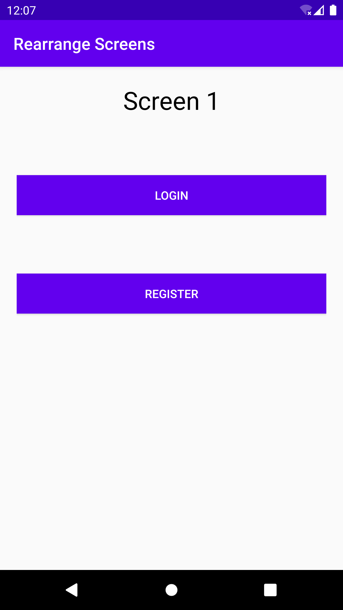
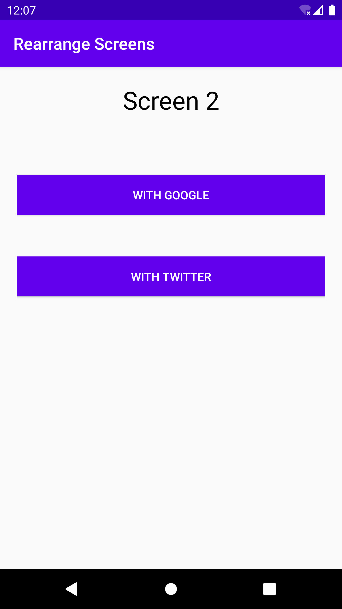
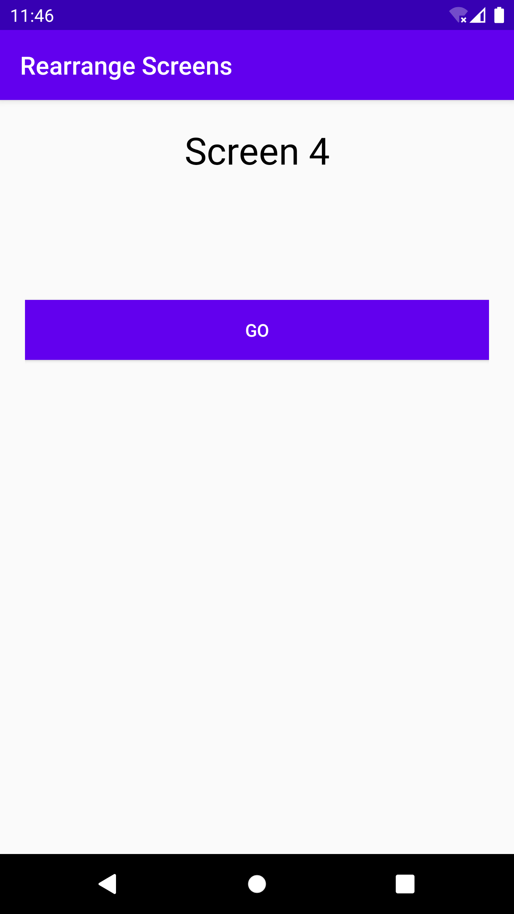
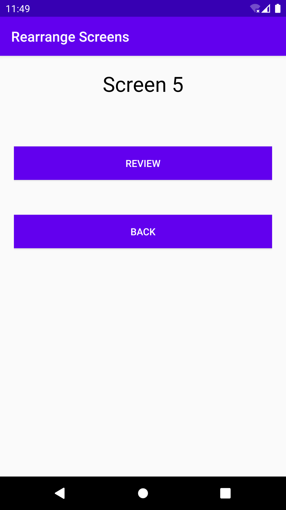
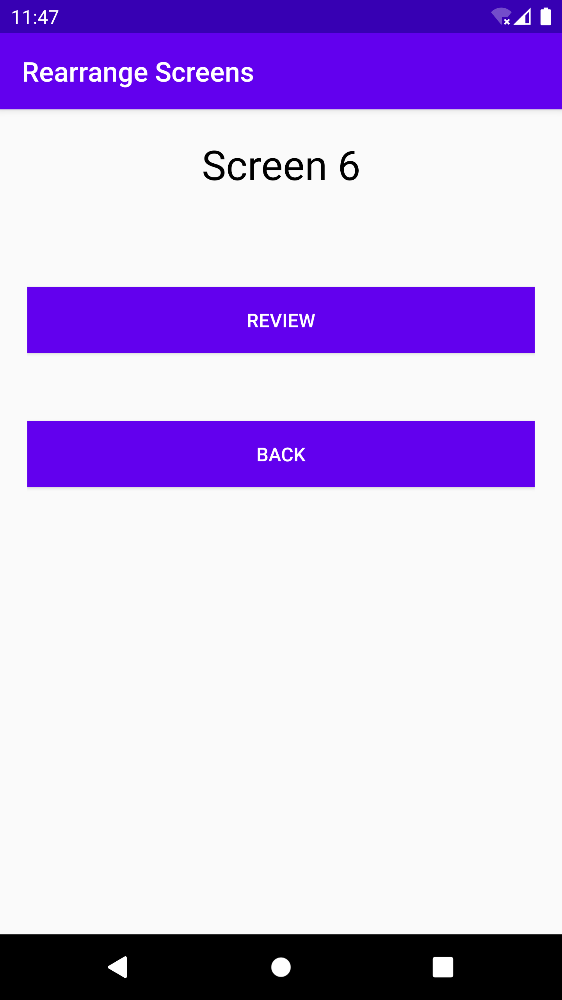
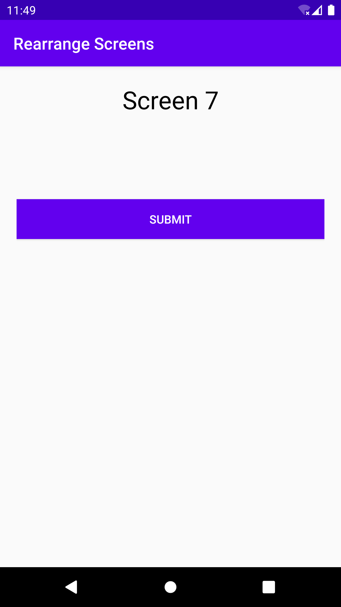
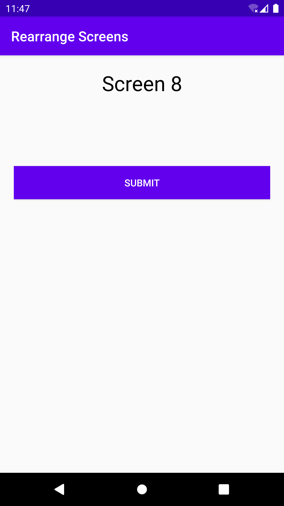

# RearrangeScreens
<!-- Improved compatibility of back to top link: See: https://github.com/othneildrew/Best-README-Template/pull/73 -->
<a name="readme-top"></a>
<!--
*** Thanks for checking out the Best-README-Template. If you have a suggestion
*** that would make this better, please fork the repo and create a pull request
*** or simply open an issue with the tag "enhancement".
*** Don't forget to give the project a star!
*** Thanks again! Now go create something AMAZING! :D
-->


<!-- PROJECT SHIELDS -->
<!--
*** I'm using markdown "reference style" links for readability.
*** Reference links are enclosed in brackets [ ] instead of parentheses ( ).
*** See the bottom of this document for the declaration of the reference variables
*** for contributors-url, forks-url, etc. This is an optional, concise syntax you may use.
*** https://www.markdownguide.org/basic-syntax/#reference-style-links
-->


<!-- PROJECT LOGO -->
<br />
<div align="center">
  <a href="https://github.com/sirichandanagangam/RearrangeScreens-android">
    
  </a>

  <p align="center">
    Change the order of screens of the mobile application without shipping a new executable of the application.
    <br />
    <a href="https://oregonstate-innovationlab.atlassian.net/wiki/spaces/RS/pages/29949953/PRODUCT+REQUIREMENTS"><strong>Explore the docs »</strong></a>
  </p>
</div>

<!-- TABLE OF CONTENTS -->
<details>
  <summary>Table of Contents</summary>
  <ol>
    <li>
      <a href="#about-the-project">About The Project</a>
      <ul>
        <li><a href="#built-with">Built With</a></li>
      </ul>
    </li>
    <li>
      <a href="#getting-started">Getting Started</a>
      <ul>
        <li><a href="#prerequisites">Prerequisites</a></li>
        <li><a href="#installation">Installation</a></li>
      </ul>
    </li>
    <li><a href="#contact">Contact</a></li>
    <li><a href="#acknowledgments">Acknowledgments</a></li>
  </ol>
</details>


<!-- ABOUT THE PROJECT -->
## About The Project
Reorder Screens is a platform that enables you to rearrange the screens of a mobile application without having to make any changes to the underlying source code and so without having to re-upload the build to an app marketplace. This can help reduce development costs and speed up deployment. While Reorder Screens is a prototype built for Google’s Android platform and so focuses on obviating the need to re-upload to Google Play, Google’s app marketplace, it is a proof of concept that is not specific to Google Play and Android. The same idea can be applied to Apple’s App Store and IOS, or in principle to any other distribution platform. Reorder Screens includes a Software Development Kit (SDK), a web portal, and a back-end that connects the two. The web portal shows a screen flowchart for the mobile application, which reflects the actual order in which the screens appear in the mobile application. Using the web portal, the Product Owner can change the screen order without having to lean on the help of a software developer. The Android SDK has the logic to rearrange the screens of the Android mobile application based on the order received from the web portal via Reorder Screen’s back-end.

<p align="right">(<a href="#readme-top">back to top</a>)</p>


### Built With
* <a href="https://mockk.io/doc/kotlin-logo.png" target="_blank"></a>

* [![React][React.js]][React-url]

<p align="right">(<a href="#readme-top">back to top</a>)</p>


<!-- GETTING STARTED -->
## Getting Started
Steps to setup this project locally : 

### Prerequisites
* Java

### Installation
```sh
git clone https://github.com/sirichandanagangam/RearrangeScreens-android.git
git remote add RearrangeScreens-android https://github.com/sirichandanagangam/RearrangeScreens-android.git
git fetch
```
The code of the website in which you have to change the order is https://github.com/sirichandanagangam/RearrangeScreens-Website
<!-- USAGE EXAMPLES -->
## Screenshots
<table>
  
<td>

  </td>
  <td>

  </td>
  <td>

  </td>
</table>
<table>
 
 <td> 

  </td>
  <td>

  </td>
  <td>

  </td>
 </table>
 <table>
  <td>

    </td>
    <td>

</td>
</th>
</table>


<p align="right">(<a href="#readme-top">back to top</a>)</p>


<!-- CONTACT -->
## Contact

Siri Chandana Gangam - [Linkedin](https://www.linkedin.com/in/siri-chandana-gangam-b27716157/) - gangamsirichandana@gmail.com

Project Link: [https://github.com/sirichandanagangam/RearrangeScreens-android](https://github.com/sirichandanagangam/RearrangeScreens-android)

<p align="right">(<a href="#readme-top">back to top</a>)</p>


<!-- ACKNOWLEDGMENTS -->
## Acknowledgments
It was my parents' sacrifices that enabled me to remain committed to my education, and I wish to thank them for that. I would like to express my gratitude to my mentor, professor Dr. Will Braynen, for his guidance and challenging tasks along this journey which enabled me to comprehend the concepts. I would like to thank my committee members Mike Bailey and Arash Termehchy for their flexibility regarding scheduling the exam. The contributions of Bhavana Bandam Reddy and Yashoda in reviewing my code and helping me in maintaining the coding standards are highly appreciated.

<p align="right">(<a href="#readme-top">back to top</a>)</p>


<!-- MARKDOWN LINKS & IMAGES -->
<!-- https://www.markdownguide.org/basic-syntax/#reference-style-links -->
[linkedin-url]: https://www.linkedin.com/in/siri-chandana-gangam-b27716157/
[React.js]: https://img.shields.io/badge/React-20232A?style=for-the-badge&logo=react&logoColor=61DAFB
[Kotlin]: https://mockk.io/doc/kotlin-logo.png
[React-url]:https://reactjs.org/
[Kotlin-url]:https://kotlinlang.org/

